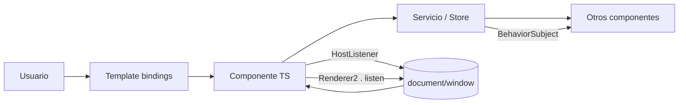

# MemoWorks

MemoWorks es una aplicación diseñada para ayudar a los usuarios a organizar y gestionar sus notas y tareas de manera eficiente. Con una interfaz intuitiva y funcionalidades avanzadas, MemoWorks facilita la creación, edición y seguimiento de notas y listas de tareas.

## Documentacion

### Características Principales

- **Gestión de Notas**: Crear, editar y eliminar notas fácilmente.
- **Listas de Tareas**: Crear listas de tareas con diferentes etiquetas.
- **Recordatorios**: Configurar recordatorios para tareas importantes.
- **Creación de grupos**: crea grupos familiares para poder asignar tareas a otros usuarios
- **Sincronización en la Nube**: Accede a tus notas y tareas desde cualquier dispositivo.
- **Interfaz Intuitiva**: Diseño amigable y fácil de usar.
- **Autenticación Segura**: Inicio de sesión y registro con seguridad avanzada.
- **Notificaciones**: Recibe notificaciones para recordatorios y actualizaciones importantes por correo electrónico.
- **Modo Oscuro**: Opción para cambiar entre modo claro y oscuro para una mejor experiencia visual.
- **Búsqueda Rápida**: Función de búsqueda para encontrar notas y tareas rápidamente.
- **Sistema de idiomas**: Soporte para múltiples idiomas, incluyendo español e inglés.

### Tecnologías Utilizadas

- **Frontend**: Angular para una experiencia de usuario dinámica y responsiva.
- **Backend**: Spring Boot para una gestión robusta de datos y lógica de negocio.
- **Base de Datos**: MySQL para almacenamiento seguro y eficiente de datos.
- **Autenticación**: JWT para asegurar el acceso a la aplicación.
- **Despliegue**: Docker y render para facilitar la implementación y escalabilidad de la aplicación.
- **Diseño UI/UX**: Figma para prototipado y diseño de interfaces.

### Instalación y Configuración

1. Clona el repositorio desde GitHub:
    ```bash
    git clone <REPO_URL>
   ```
2. Configura la base de datos MySQL y actualiza las credenciales en el archivo de configuración del backend.
3. Navega al directorio del backend y ejecuta la aplicación Spring Boot.
4. Navega al directorio del frontend y ejecuta la aplicación Angular:
    ```bash
    npm install
    npm start
    ```
5. Accede a la aplicación desde tu navegador en `http://localhost:4200`.
6. Configura las variables de entorno necesarias para la conexión a la base de datos y otros servicios.
7. Construye y despliega la aplicación utilizando Docker.
8. Sigue las instrucciones específicas para desplegar en render.
9. Abre tu navegador y accede a la URL proporcionada por render para utilizar la aplicación.

## Contribuciones

Las contribuciones son bienvenidas. Si deseas contribuir al proyecto, por favor sigue estos pasos

1. Haz un fork del repositorio.
2. Crea una nueva rama para tu característica o corrección de errores.
3. Realiza tus cambios y haz commit de los mismos.
4. Envía un pull request describiendo tus cambios.
5. Espera la revisión y aprobación de tus cambios.
6. ¡Gracias por contribuir a MemoWorks!

## Licencia

Este proyecto está licenciado bajo la Licencia MIT. Consulta el archivo LICENSE para más detalles.

## Contacto

Para cualquier consulta o soporte, por favor contacta a [cuchsou815@g.educaand.es] o a [cesar2001ricitos@gmail.com]
¡Gracias por usar MemoWorks!

URL del frontend: https://memoworks.onrender.com
URL del backend: https://backend-memoworks.onrender.com

## Arquitectura de eventos (DOM y Angular)

Arquitectura y decisiones de diseño (documentación exhaustiva)

En MemoWorks hemos seguido un enfoque consistente y documentado para el manejo de eventos en la capa de presentación con el objetivo de maximizar la accesibilidad (A11Y), la mantenibilidad y la compatibilidad con distintos entornos (incluido SSR). Las plantillas Angular usan bindings declarativos siempre que es posible: `(click)`, `(submit)`, `(input)`, `(keydown)`, `(focusin)` y `(focusout)` enlazan a métodos de componente que realizan la lógica de negocio o delegan en servicios. Este patrón mantiene la UI libre de lógica compleja y facilita las pruebas unitarias.

Para eventos globales o que afectan al documento entero (por ejemplo detectar la tecla Escape o clicks fuera de un componente) empleamos `@HostListener('document:...')` o, cuando se requiere mayor control de ciclo de vida, `Renderer2.listen(...)`. Las escuchas creadas por `Renderer2.listen` se almacenan y se limpian en `ngOnDestroy()` ejecutando las funciones de cancelación devueltas por el `listen`. Esto evita fugas de memoria y comportamientos no deseados tras desmontar componentes dinámicos.

Manipulación del DOM: cuando es necesario crear, eliminar o modificar nodos dinámicamente utilizamos `Renderer2` (`createElement`, `appendChild`, `setAttribute`, `addClass`, `removeClass`, `listen`) en lugar de `document.createElement` o `nativeElement` directo. Esto preserva compatibilidad con Universal (SSR) y reduce riesgo XSS. Los accesos a `nativeElement` se limitan y se realizan dentro de `ngAfterViewInit()` cuando el elemento ya existe en el DOM. Además, `ngOnDestroy()` restaura cualquier cambio global (por ejemplo quitar la clase `modal-open` del body y eliminar atributos `aria-hidden`).

Gestión de foco y accesibilidad: los componentes modales guardan el foco previo, lo trasladan al primer elemento focusable al abrir y lo restauran al cerrar. Implementamos un trap de Tab para mantener la navegación limitada dentro del modal y evitamos que el usuario tabule elementos del background. El menú hamburguesa y la bandeja de notificaciones actualizan `aria-expanded` y usan `aria-controls` para enlazar el trigger con el panel controlado. Las pestañas (`app-tabs`) implementan `role="tablist"`, `role="tab"`, `aria-selected`, `aria-controls` y navegación por teclado con flechas, Home y End; además solo la pestaña activa tiene `tabindex=0` (las demás `-1`). Los tooltips exponen `role="tooltip"`, `aria-describedby` y soportan activación por teclado y cierre con Escape.

Control de eventos (preventDefault y stopPropagation): en acciones de teclado que pudieran interferir con el comportamiento nativo (por ejemplo flechas en tabs) usamos `event.preventDefault()` para evitar scroll o comportamiento por defecto; `stopPropagation()` se aplica únicamente en casos controlados cuando es necesario impedir que un evento burbujee hasta un listener global (por ejemplo evitar que un click dentro de un menú cierre un listener `document:click`). Todas estas decisiones están documentadas in situ con comentarios breves justificando la razón.

Comunicación entre componentes: usamos servicios singleton (por ejemplo `AuthModalService`, `ThemeService`) con Subjects/Signals/BehaviorSubjects para comunicar acciones entre componentes no relacionados jerárquicamente. Esto desacopla la UI de detalles de implementación del DOM y facilita testing.

Buenas prácticas aplicadas:

- Evitar listeners dispersos y usar `@HostListener` o `Renderer2.listen` con limpieza en `ngOnDestroy()`.
- Evitar `document.createElement` y manipulaciones directas del DOM desde templates; usar `Renderer2` o `ViewChild`.
- Gestionar foco y atributos ARIA (aria-hidden, aria-expanded, aria-controls, role) en componentes interactivos.
- Documentar en README los eventos globales usados y su propósito.

Diagrama de flujo de eventos (Mermaid)



Tabla de compatibilidad (resumen por evento / API)

| Evento / API                               |  Chrome | Firefox |    Safari |    Edge | Notas / Fallback                                                                              |
|--------------------------------------------|--------:|--------:|----------:|--------:|-----------------------------------------------------------------------------------------------|
| click                                      |       ✅ |       ✅ |         ✅ |       ✅ | Nativo, no requiere polyfill                                                                  |
| keydown (Escape/Arrows/Enter/Space)        |       ✅ |       ✅ |         ✅ |       ✅ | Usado para accesibilidad; usar preventDefault cuando corresponda                              |
| focusin / focusout                         |       ✅ |       ✅ |         ✅ |       ✅ | Recomendado frente a focus/blur por propagación                                               |
| matchMedia('(prefers-color-scheme)')       | ✅ (76+) | ✅ (67+) | ✅ (12.1+) | ✅ (79+) | Escuchar cambios con addEventListener('change') o addListener para compatibilidad incremental |
| document / window listeners (HostListener) |       ✅ |       ✅ |         ✅ |       ✅ | Requiere comprobaciones SSR (typeof window !== 'undefined') si se usa en Universal            |

Cómo probar (resumen rápido)

- Modal: abrir modal → tab debe enfocar el primer control dentro del modal; Escape cierra; al cerrar el foco vuelve al disparador; el body no debe scrollear cuando modal abierto (clase `modal-open`).
- Menú hamburguesa: abrir menú → Escape cierra; click fuera cierra; atributo `aria-expanded` del botón actualiza correctamente; `aria-controls` enlaza con el panel.
- Tabs: navegar con ArrowLeft/ArrowRight/Home/End y verificar que `aria-selected` y `tabindex` reflejan el estado; panels deben tener `role="tabpanel"` y `aria-labelledby` apuntando a la pestaña.
- Tooltip: foco en trigger + Enter/Space muestra tooltip; `aria-describedby` apunta correctamente al elemento tooltip; Escape lo cierra.

Comandos útiles (desarrollo)

- Instalar dependencias: `npm ci --legacy-peer-deps`
- Servir en desarrollo: `npm start`
- Build producción: `npm run build`
- Ejecutar tests unitarios (Karma/Jasmine): `npm test`

## Optimización de carga (preload / modulepreload)

Se añadió un script que inyecta automáticamente enlaces de `preload` y `modulepreload` en el `index.html` generado en `dist/` para reducir la cadena crítica y mejorar LCP.

- Usa: `npm run build:prod` — realiza la build de producción y ejecuta el script que inyecta los enlaces en `dist/MemoWorks/index.html`.
- El script se encuentra en `scripts/inject-preload.js` y añade `<link rel="modulepreload">` para los bundles JS y `<link rel="preload" as="style">` + `<link rel="stylesheet">` para los CSS generados.

Notas:

- Revisa `dist/MemoWorks/index.html` después de la build para confirmar los enlaces inyectados.
- Es una mejora automática sencilla; para un ajuste fino (preload selectivo de chunks críticos) revisa el contenido de `dist/` y adapta `scripts/inject-preload.js` según tus prioridades.

